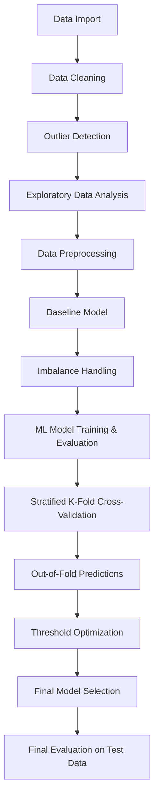

# Bank Marketing
## Project Overview
This project focuses on predicting whether a bank customer will subscribe to a term deposit based on customer and campaign-related characteristics.
The project emphasizes imbalanced classification, with the primary objective of maximizing recall while maintaining a minimum precision of ~40%.
Precision-Recall curves were used for decision-threshold selection and multiple imbalance-handling techniques were evaluated to improve minority-class detection.

---

## Problem Statement

The objective is to identify customers who are likely to subscribe to a term deposit while maintaining a minimum precision of ~40%.
This prject considered **low-cost marketing case** where contacting non-subscribers is relatively inexpensive so low precision is acceptable. Therefore, we focus on maximizing ** Recall ** while maintaining the minimum ** Precision** of **~40%**.

> Objective: **maximize Recall subject to Precision ≥ 40%.**

The project evaluates multiple Machine Learning models and imbalance-handling techniques to determine which approach provides reliable minority-class detection.

---

## Dataset
The dataset contains **45,211 customer records** and **17 features**, including demographic information, account details, and previous campaign outcomes.

| Feature | Non-Null Count | Data Type |
|---|---:|---|
| age | 45,211 | int64 |
| job | 45,211 | object |
| marital | 45,211 | object |
| education | 45,211 | object |
| default | 45,211 | object |
| balance | 45,211 | int64 |
| housing | 45,211 | object |
| loan | 45,211 | object |
| contact | 45,211 | object |
| day | 45,211 | int64 |
| month | 45,211 | object |
| duration | 45,211 | int64 |
| campaign | 45,211 | int64 |
| pdays | 45,211 | int64 |
| previous | 45,211 | int64 |
| poutcome | 45,211 | object |
| y | 45,211 | object |

### Target Variable

- `no` → Customer did not subscribe to a term deposit
- `yes` → Customer subscribed to a term deposit

---

## Project Workflow

---

## Exploratory Data Analysis
1. No 'NaN' and duplicate observations
2. Customers with no loan are most likely to subscribe to a term deposit. Very few customers have both loans(personal and home loan) and only a small number of them have susbcribed to a term deposit.
3. The average account balance tends to increase with age, with customers above 60 years generally having higher balances.

   

5. For about 90% of customers, the previous campaign outcome is unknown, and only a small proportion subscribed to the term deposit. Customers with a previous campaign outcome of failure or other are less likely    to subscribe to a term deposit.
   | y | no |	yes |
   |---|---|---|
   | poutcome | | |		
   | failure | 87.4 |	12.6 |
   | other	| 83.3 | 16.7 |
   | success | 35.3 |	64.7 |
   | unknown | 90.8 |	9.2 |
6. Skewness:
    | features | Skewness |
    | ------ | ------ |
    | age | 0.6848 |
    |  duration | 3.1442 |
    | balance | 8.3600 |
    | pdays | 2.6156 |
    | previous | 41.8451 |
    | campaign | 4.8985 |

 ---
 
### Key findings
1. Outlier's summary:
   | feature | lower_bound | upper_bound | outliers |	outlier_percentage |
   |---|---:|---:|---:|---:|
   | age | 10.5	| 70.5 | 487 | 1.08 |
   | duration | -221.0 | 643.0 | 3235 | 7.16 |
   | balance | -1962.0 | 3462.0 | 4729 | 10.46 |
   | pdays | -1.0 | -1.0 | 8257 | 18.26 |
   | previous | 0.0 | 0.0 | 8257 | 18.26 |
   | campaign | -2.0 | 6.0 | 3064 | 6.78 |

    *Majority of these observations are not data errors. They might be potential ror genuine high-value customers.*
2. **Imbalance**
  The dataset is highly imbalanced, with about 88% of customers not subscribing to the term deposit. Here, majority class is 'no' and minority class is 'yes'. Therefore, imbalance data handling techniques should be applied before training classification models.
   | Target (`y`) | Count |
   |---|---:|
   | `no` | 39,922 |
   | `yes` | 5,289 |

---

## Data Preprocessing
1. 'yeo-johnson' transformation to skewed features
2. Standardize all continuous features
3. One hot encoding to all categorical features
4. Ordinal encoding to ordinal features
5. Label encoder to target feature

---

## Machine Learning Models
The following models were evaluated:
1. Logistic Regression(Baseline Model)
2. Random Forest
3. Gradient Boosting
4. AdaBoost
5. Decision Tree
6. SVM
7. XGBoost
8. Bagging
9. ExtraTrees
10. Bernoulli naive bayes

---

## Model Evaluation
The model were evaluated using metrics:
- Accuracy
- Precision
- Recall
- Precision Recall curve
- Average Precison score(AP)

Imbalanced data techniques used:
- SMOTENC
- Cost Sensitive Learning (balanced weights)
- Cost Sensitive Learning (sample weights)
- SMOTENC + CSL(sample weights)
    
*Since the dataset is imbalanced Recall, Average Precison score were given greater importance.*

---

**Model Evaluation**

Using SMOTENC:

| Model | Threshold | Precision | Recall | Average Precision (AP) |
|---|---:|---:|---:|---:|
| RandomForest | 0.290000 | 0.401888 | 0.879224 | 0.567086 |
| XGBoost | 0.199191 | 0.400057 | 0.876721 | 0.583165 |
| ExtraTrees | 0.290000 | 0.401817 | 0.857947 | 0.555182 |
| GradientBoost | 0.405334 | 0.400059 | 0.850438 | 0.569166 |
| SVM | 0.277791 | 0.400059 | 0.850438 | 0.568034 |
| Bagging | 0.400000 | 0.429446 | 0.790363 | 0.495126 |
| AdaBoost | 0.498909 | 0.402246 | 0.762203 | 0.538142 |
| DecisionTree | 1.000000 | 0.407917 | 0.593242 | 0.289915 |
| BernoulliNB | 0.835132 | 0.400000 | 0.510638 | 0.436079 |

Using CSL(sample weights)

`sample_weights = np.where(
    y_train_processed == 1,
    (y_train_processed == 0).sum() / (y_train_processed == 1).sum(), 1 )`
    
| Model | Threshold | Precision | Recall | Average Precision (AP) |
|---|---:|---:|---:|---:|
| SVM | 0.098495 | 0.400055 | 0.910513 | 0.584146 |
| XGBoost | 0.243910 | 0.400055 | 0.908010 | 0.607253 |
| RandomForest | 0.120000 | 0.400280 | 0.895494 | 0.606281 |
| GradientBoost | 0.458429 | 0.400056 | 0.895494 | 0.590791 |
| ExtraTrees | 0.130000 | 0.406106 | 0.882353 | 0.594165 |
| AdaBoost | 0.499145 | 0.400000 | 0.843554 | 0.562469 |
| Bagging | 0.200000 | 0.419365 | 0.818523 | 0.496372 |
| BernoulliNB | 0.898071 | 0.400111 | 0.451189 | 0.430096 |
| DecisionTree | 1.000000 | 0.461140 | 0.445557 | 0.270784 |

Using SMOTENC + CSL(sample weights)

| Model | Threshold | Precision | Recall | Average Precision (AP) |
|---|---:|---:|---:|---:|
| RandomForest | 0.270000 | 0.400746 | 0.874218 | 0.561608 |
| ExtraTrees | 0.280000 | 0.402329 | 0.864831 | 0.551997 |
| XGBoost | 0.549051 | 0.400000 | 0.863579 | 0.564892 |
| GradientBoost | 0.842002 | 0.400000 | 0.857322 | 0.564013 |
| SVM | 0.364601 | 0.400059 | 0.841677 | 0.520531 |
| AdaBoost | 0.508655 | 0.400254 | 0.788486 | 0.540073 |
| Bagging | 0.400000 | 0.426044 | 0.753442 | 0.465363 |
| DecisionTree | 1.000000 | 0.424615 | 0.604506 | 0.303276 |
| BernoulliNB | 0.974687 | 0.400000 | 0.509387 | 0.436074 |

*CSL has achieved the maximum recall at the required precision of 40% and also produced the highest AP among the three imbalanced-handling techniques.
Under CSL, SVM achieved the highest recall (91.05%), while XGBoost achieved the highest AP (0.607). Since, our goal is to maximize recall while maintaining minimum precision of 40%, SVM is the best choice. However, the difference in recall between SVM and XGBoost is small (0.25), while XGBoost has noticeably higher AP. Therefore, both models require further assessment before selecting the final model.*

---

## Model Validation
To obtain more reliable estimate of model performance:

- Stratified K-fold Cross validation
  
- Out-of-Fold predictions(OOF)

## Final Results
The final model achieved

**Recall: 0.8752**

**Precison: 0.6113**

**Average Precision (AP): 0.5494** 

**Confusion Matrix**

*The results has shown that XGBoost model generalizes reasonalbly well to unseen data, the model achieved a recall of 87.52% and precision of 61.13% with an average precision of 0.5494. Also the confusion matrix shows model successfully identified 456 out of 521 actual subscribers while missing only 65 actual susbcribers.*

---

## Installation       

Clone the repository:
cd customer-churn-prediction

Create a virtual environment:
python -m venv venv

Activate the environment:
Windows
venv\Scripts\activate

Install dependencies:
pip install -r requirements.txt

---

## Usage
Run the application:
streamlit run app/app.py

*The application allows users to enter customer information and receive a churn prediction.*

---

## Deployment
The machine learning model was deployed using Streamlit.
The application provides an interface where users can input customer information and obtain predictions from the trained model.

---

## Future Improvements
1. The minimum precision constraint can be reduced below 40%, which may allow the model to identify more potential subscribers and achieve a higher recall.
2. Above project considers low-cost maketing scenario, this analysis can be extented to a high-cost marketing scenario in which contacting customers is expensive. We have to choose model that optimizes precision subject to a minimum recall constraint.

---

## License
This project is licensed under the MIT License.

